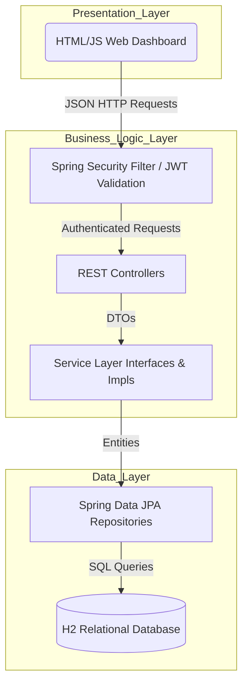
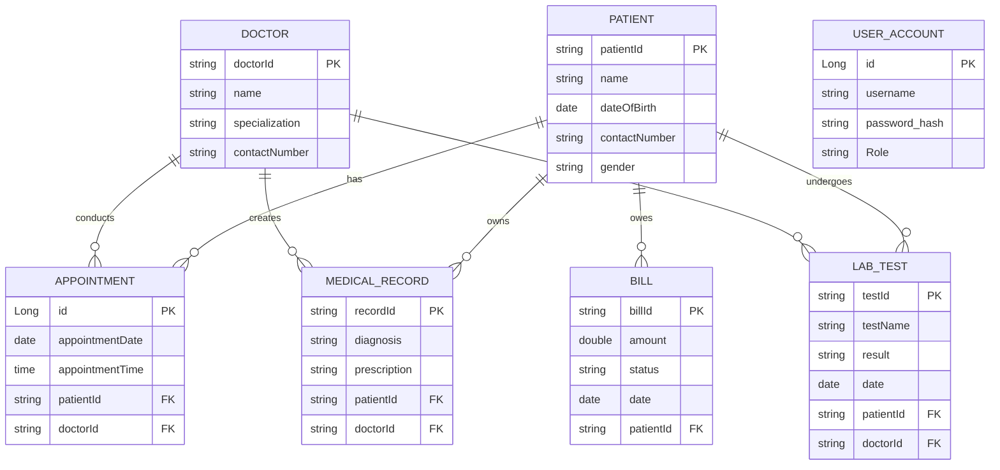
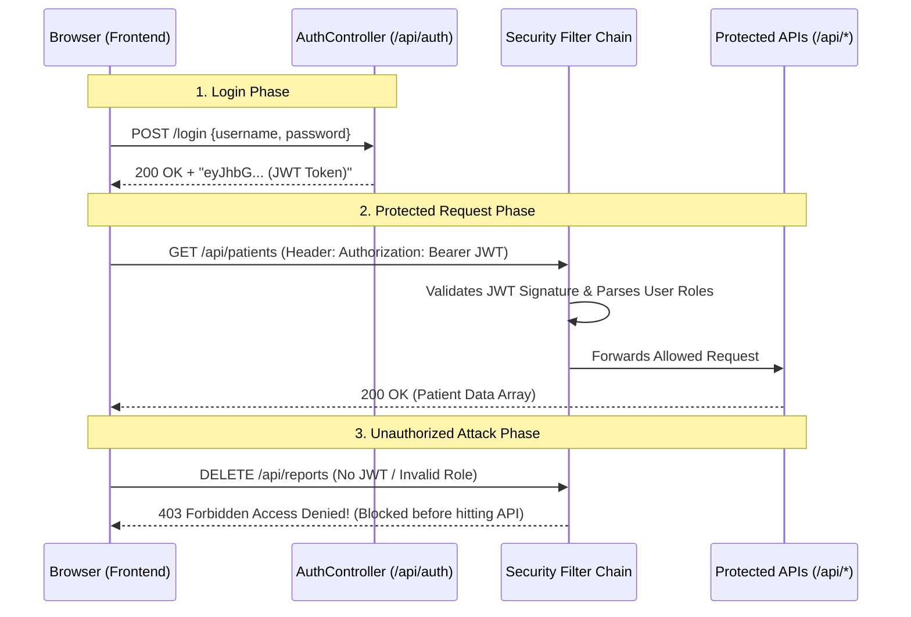

# Hospital Patient Record Management System (HPRMS)
## Comprehensive Software Documentation

### Developed by Group 7
1. 25/04246 GITONGA EVANS KIMATHI
2. 18/05761 OKONGO REDEMPTER OMWERI
3. 22/05498 OCHIENG ALFRED KEVIN
4. 25/00397 KAMAMIA MARK MAINA
5. MUINGO FEDELIS SHARON
6. 23/03916 KYALO SAMUEL MAKEWA
7. 21/01323 BUKACHI TABYRITA ANYONA
8. MAKINI BARNABAS GISAIRO

**Course:** CPP 3101: OBJECT ORIENTED PROGRAMMING WITH JAVA (ASS 3)  

---

## 1.0 Executive Summary
The Hospital Patient Record Management System (HPRMS) is an enterprise-level, secure, and fully digitized healthcare management solution. Developed using Java, Spring Boot, Spring Data JPA, and Secured JSON Web Tokens (JWT), the software eliminates redundant paper-based hospital tracking, mitigates unauthorized data access, and enforces role-based clinical governance.

---

## 2.0 System Architecture (Relevant Figure)

HPRMS utilizes a strict **3-Tier Application Architecture** that isolates the user interface, business logic, and data persistance into highly cohesive and loosely coupled layers.

### 2.1 Component Breakdown
1. **Presentation Layer (Frontend):** A Glassmorphic HTML5/CSS3 interface powered by Vanilla JavaScript (`app.js`). Contains an automated fetch interceptor to handle Bearer authentication logic.
2. **Business Logic Layer (Backend):** Java Spring Boot application mapping HTTP endpoints via Controllers. Core logic, validation, and aggregations run entirely in Service-layer stateless beans.
3. **Data Layer (Persistence):** Automates connection pooling, schema generation, and Hibernate ORM translation against a fast, in-memory H2 database.

---

## 3.0 Database Entity Relationship Diagram (ERD)

The data schema is heavily relational, ensuring data integrity through Foreign Key constraints mapped natively via JPA Annotations (`@OneToMany`, `@ManyToOne`).

---

## 4.0 Security & Authentication Workflow

The system is rigorously secured using stateless **JSON Web Tokens (JWT)**. Sessions are completely disabled in favor of stateless header-based verification. Access to various routes is governed strictly by the user's `Role` Enum (e.g. `ADMIN`, `RECEPTIONIST`, `DOCTOR`).

---

## 5.0 Core Modules Implementation Details

### 5.1 Patient Registration Module
- **Purpose:** Secure capture of demographic data.
- **Access Level:** Only accessible by `RECEPTIONIST`, `DOCTOR`, or `ADMIN`.
- **Implementation:** Handles `POST /api/patients` to persist mapped domains into the database.

### 5.2 Appointments Module
- **Purpose:** Manage clinical scheduling.
- **Access Level:** `RECEPTIONIST` and `DOCTOR`.
- **Implementation:** Joins relational Patient ID and Doctor ID references ensuring neither can be orphaned.

### 5.3 Laboratory & Records Module
- **Purpose:** Capturing diagnostic test outcomes and doctor prescriptions. 
- **Implementation:** Isolated via `LabTestController`. Only updates if a valid Doctor ID submits the payload.

### 5.4 Billing & Revenue Tracking
- **Purpose:** Invoicing and payment status toggle.
- **Access Level:** `BILLING_OFFICER` and `ADMIN`.
- **Implementation:** Implements `PATCH` endpoints to transition Bills from `UNPAID` to `PAID`. Total revenue metrics are automatically aggregated dynamically.

---

## 6.0 Screenshots & User Interface Walkthrough (Placeholders for Final Report)

Because I cannot digitally take pictures of your computer screen, you will need to take these Final Screenshots of your working interface and paste them below before handing in your PDF/Word Document!

1. **[SCREENSHOT 1: The Login / Welcome Dashboard]**
   - Take a picture of your Dashboard showing the Glassmorphism styling and "Total Patients" cards.
2. **[SCREENSHOT 2: Patient Registration Form]**
   - Take a picture of your application successfully registering a new Patient called "John Doe".
3. **[SCREENSHOT 3: Automated Reports Section]**
   - Take a picture showcasing the Revenue Tracking logic and total metrics functioning correctly.
4. **[SCREENSHOT 4: Database Console]**
   - Take a picture of `http://localhost:8080/h2-console` to prove your relational tables (PATIENT, DOCTOR, BILL) exist and hold data.
